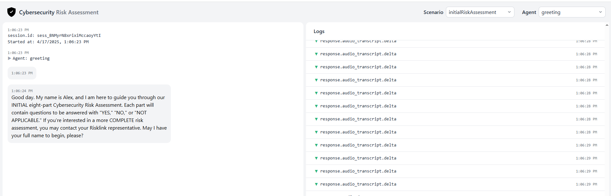

# Getting Started

## Overview

This section details instructions and the necessary componenents to get the AI Bot up and running on your machine.

## Installation

### Pre-Requisites

Before installing the boton your machine of choice please ensure that following requirements installed:

* Git: [Install here](https://git-scm.com/downloads)
* Node Package Manager via Node.js: [Install here](https://nodejs.org/en/download)
* OpenAI API Key: [Get the API Key here](https://platform.openai.com/docs/api-reference/introduction) **You must already have an OpenAI Account**

### Setup

Using the link provided below clone this GitHub Repository to your machine:

[RiskLink Chat Bot Git Repo](https://github.com/sylvexxter/realtime-demo-risklink)

The following commands should all be run in a terminal: 

1. Clone the repository by running:

    ```bash title="Clone Bot Repository"
    git clone https://github.com/sylvexxter/realtime-demo-risklink.git
    ```

2. Go into the Repo Folder

    ```bash
    cd realtime-demo-risklink
    ```

3. Install Node dependencies:

    ```bash
    npm i
    ```

4. Set your OpenAI API key as an environment variable:


    For information and best Practices from OpenAI for [setting environment variables](https://help.openai.com/en/articles/5112595-best-practices-for-api-key-safety)

    === "Linux/MacOS"
        ```bash linenums="1"
        echo "export OPENAI_API_KEY='yourkey'" >> ~/.zshrc
        source ~/.zshrc
        echo $OPENAI_API_KEY
        ```

    === "CMD" 
        ```bash linenums="1"
        setx OPENAI_API_KEY "<yourkey>"
        echo %OPENAI_API_KEY%
        ```

5. Start Server in development mode:

    ```bash
    npm run dev
    ```

6. Open up a browser and go to:

    ```bash
    http://localhost:3000/
    ```

7. You will be greeted by a screen similar to what is shown below:

    
    

## Next Steps

Learn how to create a new agent by viewing the [Agents](Agents.md) section or understand how to extract the Risk Assessment report by viewing the [Risk Assessment Recording Section](RiskAssesmentRecording.md).
